# 📚 TÀI LIỆU HOÀN CHỈNH HỆ THỐNG EDULEARN

**Version:** 1.0.0  
**Last Updated:** 2025-01-29  
**Author:** EduLearn Development Team

---

## MỤC LỤC

1. [Tổng Quan Dự Án](#1-tổng-quan-dự-án)
2. [Kiến Trúc Hệ Thống](#2-kiến-trúc-hệ-thống)
3. [Authentication & Authorization](#3-authentication--authorization)
4. [Module Class Management](#4-module-class-management)
5. [Module Exercise/Assignment](#5-module-exerciseassignment)
6. [Module Notification](#6-module-notification)
7. [Socket.IO Real-time Communication](#7-socketio-real-time-communication)
8. [API Reference](#8-api-reference)
9. [Security Architecture](#9-security-architecture)
10. [Deployment & Configuration](#10-deployment--configuration)

---

## 1. TỔNG QUAN DỰ ÁN

### 1.1. Giới Thiệu

**EduLearn** là một hệ thống quản lý học tập trực tuyến (LMS - Learning Management System) được xây dựng với kiến trúc microservices, cung cấp các tính năng:

- ✅ Quản lý lớp học và học sinh
- ✅ Tạo và quản lý bài tập
- ✅ Hệ thống thông báo real-time
- ✅ Xác thực và phân quyền bảo mật cao
- ✅ Socket.IO cho real-time communication
- ✅ AI-powered exam generation (Python Server)

### 1.2. Tech Stack

#### Frontend
- **Framework:** Next.js 14+ (App Router)
- **UI Library:** Ant Design (antd)
- **State Management:** React Hooks, Context API
- **HTTP Client:** Axios với interceptors
- **Real-time:** Socket.IO Client
- **Styling:** Tailwind CSS

#### Backend (NestJS)
- **Framework:** NestJS (Node.js)
- **Database:** MySQL
- **ORM:** TypeORM
- **Authentication:** JWT với AES-256-CBC encryption
- **Real-time:** Socket.IO
- **API Documentation:** Swagger/OpenAPI

#### Backend (Python)
- **Framework:** Flask/FastAPI
- **AI/ML:** OpenAI GPT, Ollama
- **OCR:** Tesseract, specialized models
- **Storage:** Cloudflare R2

### 1.3. Kiến Trúc Tổng Quan

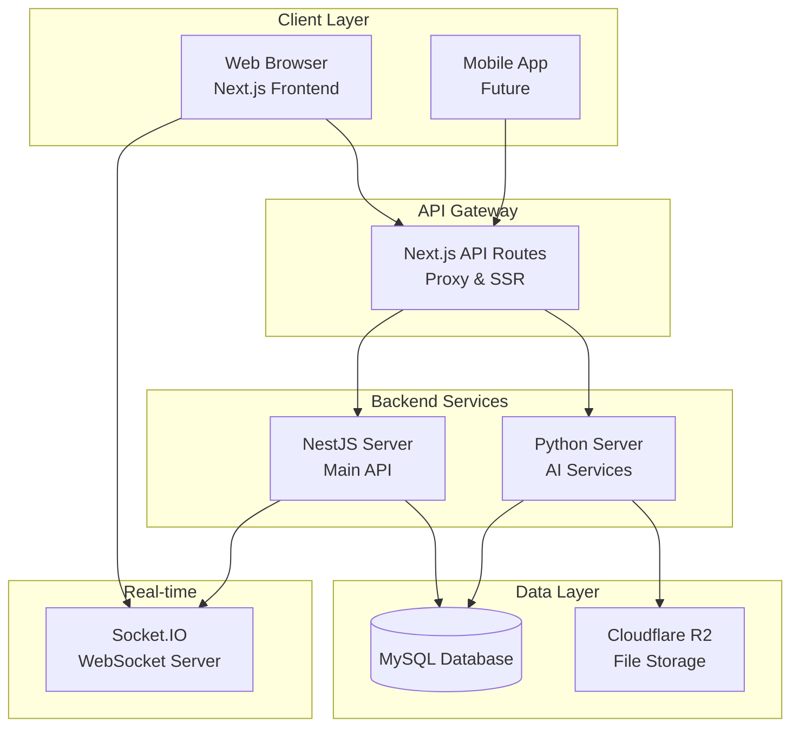
```mermaid
graph TB
    subgraph "Client Layer"
        WEB[Web Browser<br/>Next.js Frontend]
        MOBILE[Mobile App<br/>Future]
    end
    
    subgraph "API Gateway"
        NEXT_API[Next.js API Routes<br/>Proxy & SSR]
    end
    
    subgraph "Backend Services"
        NESTJS[NestJS Server<br/>Main API]
        PYTHON[Python Server<br/>AI Services]
    end
    
    subgraph "Real-time"
        SOCKET[Socket.IO<br/>WebSocket Server]
    end
    
    subgraph "Data Layer"
        MYSQL[(MySQL Database)]
        R2[Cloudflare R2<br/>File Storage]
    end
    
    WEB --> NEXT_API
    MOBILE --> NEXT_API
    NEXT_API --> NESTJS
    NEXT_API --> PYTHON
    WEB --> SOCKET
    NESTJS --> SOCKET
    NESTJS --> MYSQL
    PYTHON --> MYSQL
    PYTHON --> R2
```

### 1.4. Các Module Chính

1. **Authentication Module**
   - Sign Up / Sign In
   - JWT Token Management
   - Refresh Token Flow
   - User Profile Management

2. **Class Management Module**
   - Tạo và quản lý lớp học
   - Student enrollment
   - Class code system
   - Teacher/Student permissions

3. **Exercise/Assignment Module**
   - Tạo bài tập
   - Student submission
   - Grading system
   - File attachments

4. **Notification Module**
   - Class notifications
   - System notifications
   - Real-time delivery
   - Read/unread tracking

5. **User Management Module**
   - User CRUD
   - Role management
   - Status management

6. **Document Module**
   - Document upload
   - Document management
   - File attachments

---

## 2. KIẾN TRÚC HỆ THỐNG

### 2.1. System Architecture Diagram

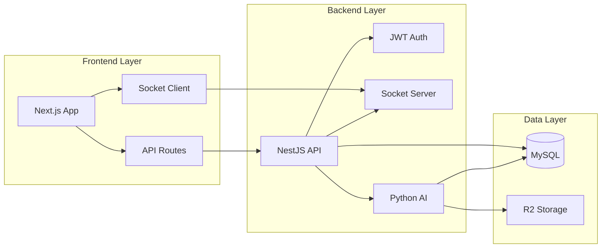
```mermaid
graph LR
    subgraph "Frontend Layer"
        A[Next.js App]
        B[API Routes]
        C[Socket Client]
    end
    
    subgraph "Backend Layer"
        D[NestJS API]
        E[JWT Auth]
        F[Socket Server]
        G[Python AI]
    end
    
    subgraph "Data Layer"
        H[(MySQL)]
        I[R2 Storage]
    end
    
    A --> B
    B --> D
    A --> C
    C --> F
    D --> E
    D --> H
    D --> F
    D --> G
    G --> H
    G --> I
```

### 2.2. Authentication Flow Architecture

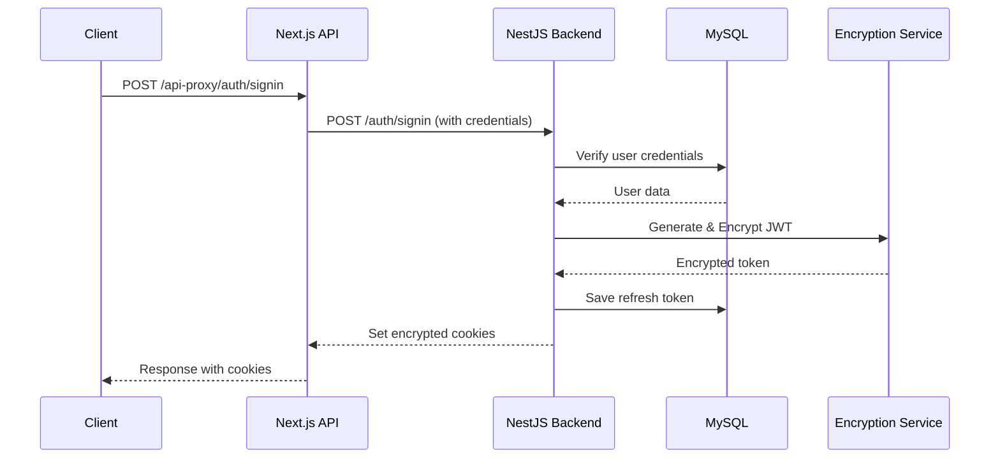
```mermaid
sequenceDiagram
    participant Client
    participant NextAPI as Next.js API
    participant NestJS as NestJS Backend
    participant DB as MySQL
    participant Encrypt as Encryption Service
    
    Client->>NextAPI: POST /api-proxy/auth/signin
    NextAPI->>NestJS: POST /auth/signin (with credentials)
    NestJS->>DB: Verify user credentials
    DB-->>NestJS: User data
    NestJS->>Encrypt: Generate & Encrypt JWT
    Encrypt-->>NestJS: Encrypted token
    NestJS->>DB: Save refresh token
    NestJS-->>NextAPI: Set encrypted cookies
    NextAPI-->>Client: Response with cookies
```

### 2.3. Request Flow với JWT Protection

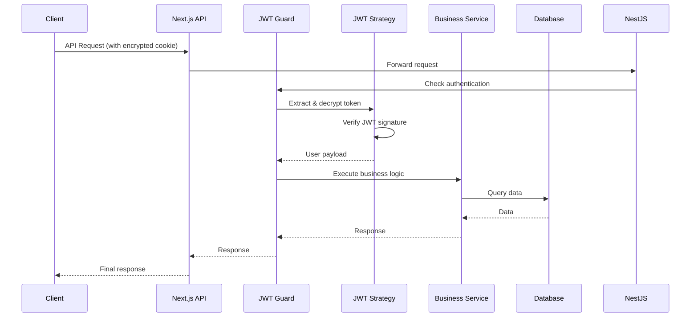
```mermaid
sequenceDiagram
    participant Client
    participant NextAPI as Next.js API
    participant Guard as JWT Guard
    participant Strategy as JWT Strategy
    participant Service as Business Service
    participant DB as Database
    
    Client->>NextAPI: API Request (with encrypted cookie)
    NextAPI->>NestJS: Forward request
    NestJS->>Guard: Check authentication
    Guard->>Strategy: Extract & decrypt token
    Strategy->>Strategy: Verify JWT signature
    Strategy-->>Guard: User payload
    Guard->>Service: Execute business logic
    Service->>DB: Query data
    DB-->>Service: Data
    Service-->>Guard: Response
    Guard-->>NextAPI: Response
    NextAPI-->>Client: Final response
```

---

## 3. AUTHENTICATION & AUTHORIZATION

### 3.1. Authentication Flow - Sign In

**Sequence Diagram:**

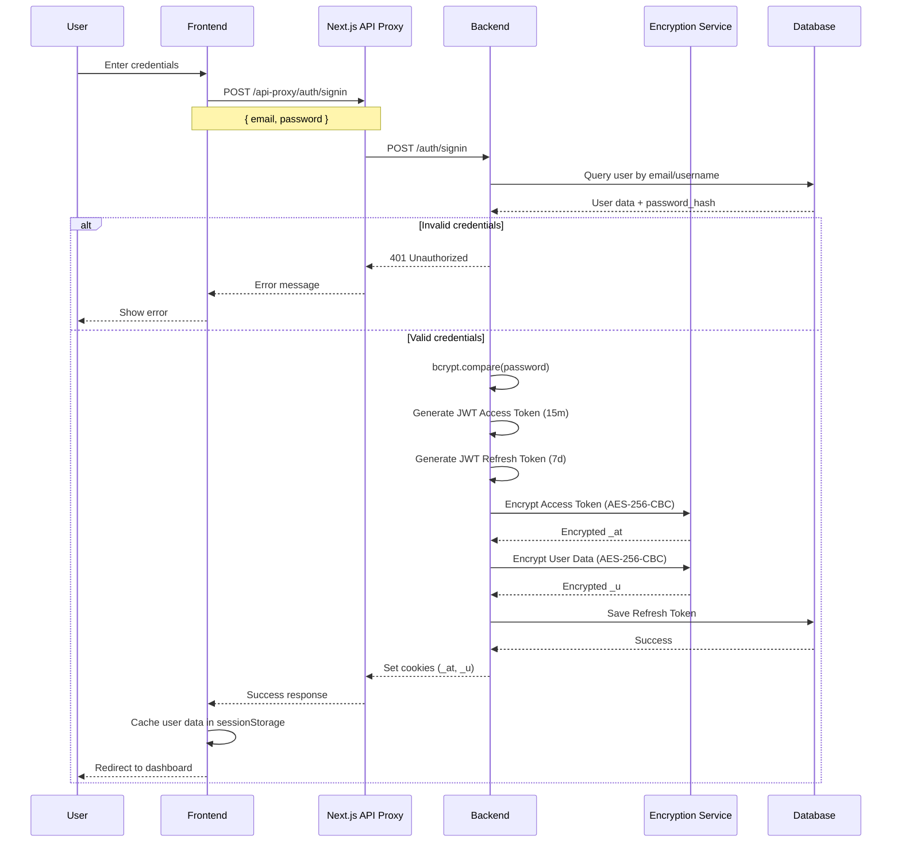
```mermaid
sequenceDiagram
    participant User
    participant Frontend
    participant NextAPI as Next.js API Proxy
    participant Backend
    participant Encrypt as Encryption Service
    participant DB as Database
    
    User->>Frontend: Enter credentials
    Frontend->>NextAPI: POST /api-proxy/auth/signin
    Note over Frontend,NextAPI: { email, password }
    NextAPI->>Backend: POST /auth/signin
    Backend->>DB: Query user by email/username
    DB-->>Backend: User data + password_hash
    
    alt Invalid credentials
        Backend-->>NextAPI: 401 Unauthorized
        NextAPI-->>Frontend: Error message
        Frontend-->>User: Show error
    else Valid credentials
        Backend->>Backend: bcrypt.compare(password)
        Backend->>Backend: Generate JWT Access Token (15m)
        Backend->>Backend: Generate JWT Refresh Token (7d)
        Backend->>Encrypt: Encrypt Access Token (AES-256-CBC)
        Encrypt-->>Backend: Encrypted _at
        Backend->>Encrypt: Encrypt User Data (AES-256-CBC)
        Encrypt-->>Backend: Encrypted _u
        Backend->>DB: Save Refresh Token
        DB-->>Backend: Success
        Backend-->>NextAPI: Set cookies (_at, _u)
        NextAPI-->>Frontend: Success response
        Frontend->>Frontend: Cache user data in sessionStorage
        Frontend-->>User: Redirect to dashboard
    end
```

**API Endpoint:**

```
POST /api/auth/signin
Content-Type: application/json

Request Body:
{
  "emailOrUsername": "user@example.com",
  "password": "password123",
  "device_name": "Chrome Browser"
}

Response (200 OK):
{
  "status": true,
  "message": "Đăng nhập thành công",
  "data": {
    "user": {
      "user_id": 1,
      "username": "john_doe",
      "fullname": "John Doe",
      "email": "user@example.com",
      "role_id": 2,
      ...
    },
    "access_token": "eyJhbGciOiJIUzI1NiIsInR5cCI6IkpXVCJ9..."
  }
}

Cookies Set:
- _at: Encrypted access token (httpOnly, secure, sameSite)
- _u: Encrypted user data (httpOnly, secure, sameSite)
```

**Validation Checks:**
- ✅ Email/username tồn tại
- ✅ Password khớp với hash
- ✅ User status = "online"
- ✅ Role hợp lệ

### 3.2. Authentication Flow - Sign Up

**Sequence Diagram:**

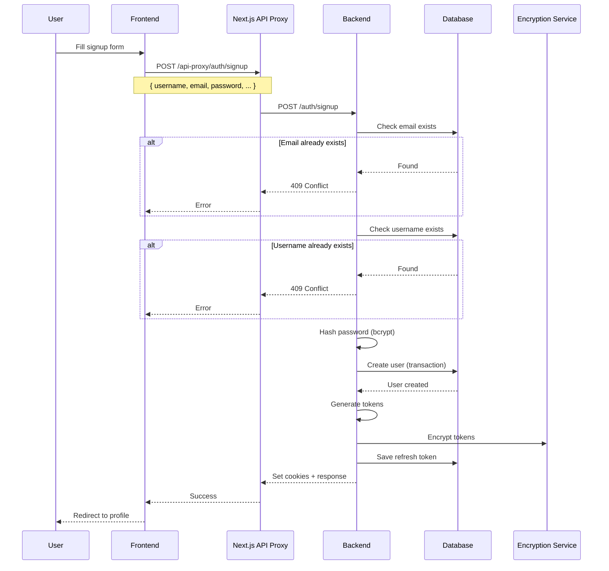
```mermaid
sequenceDiagram
    participant User
    participant Frontend
    participant NextAPI as Next.js API Proxy
    participant Backend
    participant DB as Database
    participant Encrypt as Encryption Service
    
    User->>Frontend: Fill signup form
    Frontend->>NextAPI: POST /api-proxy/auth/signup
    Note over Frontend,NextAPI: { username, email, password, ... }
    NextAPI->>Backend: POST /auth/signup
    
    Backend->>DB: Check email exists
    alt Email already exists
        DB-->>Backend: Found
        Backend-->>NextAPI: 409 Conflict
        NextAPI-->>Frontend: Error
    end
    
    Backend->>DB: Check username exists
    alt Username already exists
        DB-->>Backend: Found
        Backend-->>NextAPI: 409 Conflict
        NextAPI-->>Frontend: Error
    end
    
    Backend->>Backend: Hash password (bcrypt)
    Backend->>DB: Create user (transaction)
    DB-->>Backend: User created
    
    Backend->>Backend: Generate tokens
    Backend->>Encrypt: Encrypt tokens
    Backend->>DB: Save refresh token
    Backend-->>NextAPI: Set cookies + response
    NextAPI-->>Frontend: Success
    Frontend-->>User: Redirect to profile
```

**API Endpoint:**

```
POST /api/auth/signup
Content-Type: application/json

Request Body:
{
  "username": "john_doe",
  "fullname": "John Doe",
  "email": "user@example.com",
  "phone": "0123456789",
  "password": "password123",
  "role_id": 3,
  "device_name": "Chrome Browser"
}

Response (201 Created):
{
  "status": true,
  "message": "Đăng ký thành công",
  "data": {
    "user": { ... },
    "access_token": "..."
  }
}
```

### 3.3. Refresh Token Flow

**Sequence Diagram:**

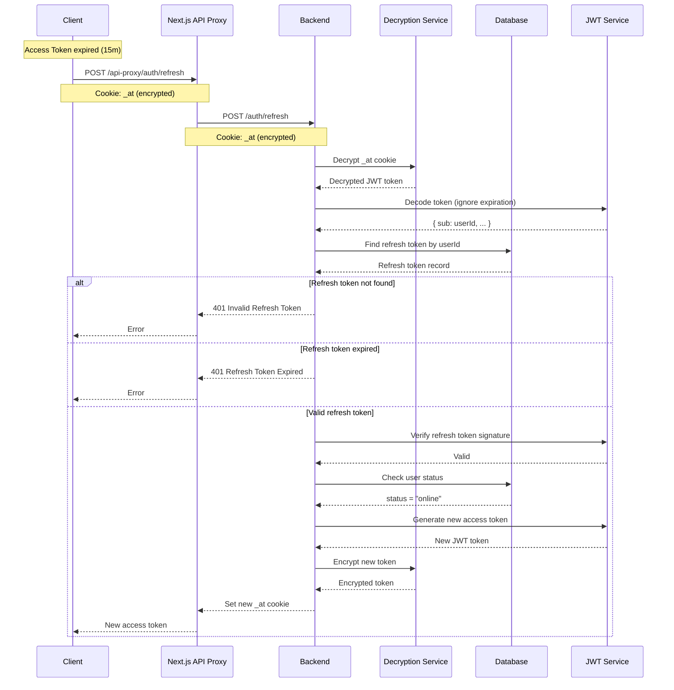
```mermaid
sequenceDiagram
    participant Client
    participant NextAPI as Next.js API Proxy
    participant Backend
    participant Decrypt as Decryption Service
    participant DB as Database
    participant JWT as JWT Service
    
    Note over Client: Access Token expired (15m)
    Client->>NextAPI: POST /api-proxy/auth/refresh
    Note over Client,NextAPI: Cookie: _at (encrypted)
    NextAPI->>Backend: POST /auth/refresh
    Note over NextAPI,Backend: Cookie: _at (encrypted)
    
    Backend->>Decrypt: Decrypt _at cookie
    Decrypt-->>Backend: Decrypted JWT token
    
    Backend->>JWT: Decode token (ignore expiration)
    JWT-->>Backend: { sub: userId, ... }
    
    Backend->>DB: Find refresh token by userId
    DB-->>Backend: Refresh token record
    
    alt Refresh token not found
        Backend-->>NextAPI: 401 Invalid Refresh Token
        NextAPI-->>Client: Error
    else Refresh token expired
        Backend-->>NextAPI: 401 Refresh Token Expired
        NextAPI-->>Client: Error
    else Valid refresh token
        Backend->>JWT: Verify refresh token signature
        JWT-->>Backend: Valid
        
        Backend->>DB: Check user status
        DB-->>Backend: status = "online"
        
        Backend->>JWT: Generate new access token
        JWT-->>Backend: New JWT token
        
        Backend->>Decrypt: Encrypt new token
        Decrypt-->>Backend: Encrypted token
        
        Backend-->>NextAPI: Set new _at cookie
        NextAPI-->>Client: New access token
    end
```

**API Endpoint:**

```
POST /api/auth/refresh
Headers:
  Cookie: _at=<encrypted_token>

Response (200 OK):
{
  "status": true,
  "data": {
    "access_token": "eyJhbGciOiJIUzI1NiIsInR5cCI6IkpXVCJ9..."
  }
}
```

**Key Points:**
- Access token có thể đã hết hạn (decode ignore expiration)
- Tìm refresh token trong DB dựa trên userId từ access token
- Verify refresh token signature
- Check refresh token expiry trong DB
- Generate access token mới

### 3.4. JWT Guard - Route Protection

**Flow Diagram:**

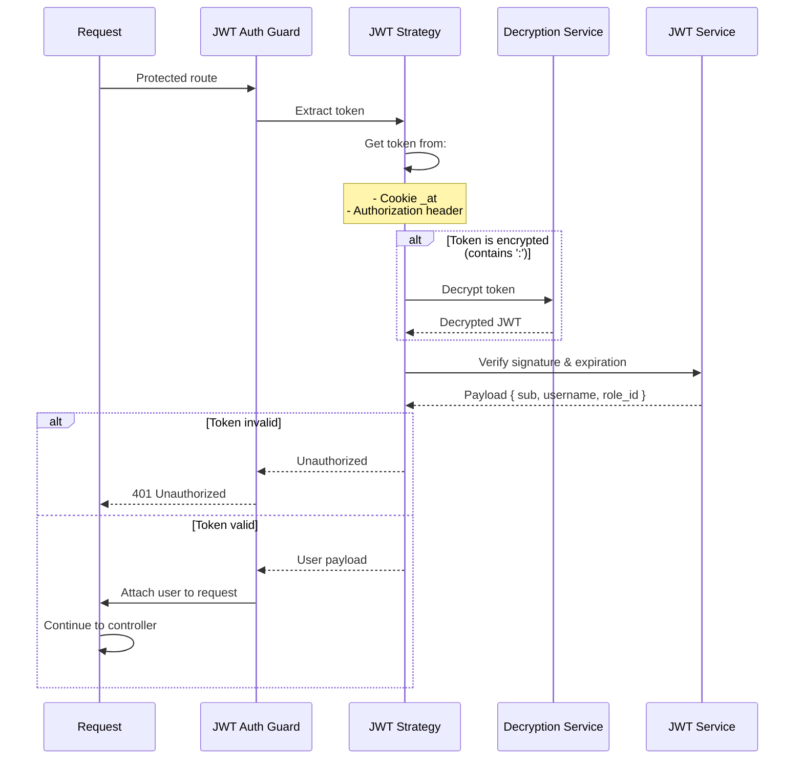
```mermaid
sequenceDiagram
    participant Request
    participant Guard as JWT Auth Guard
    participant Strategy as JWT Strategy
    participant Decrypt as Decryption Service
    participant JWT as JWT Service
    
    Request->>Guard: Protected route
    Guard->>Strategy: Extract token
    Strategy->>Strategy: Get token from:
    Note over Strategy: - Cookie _at<br/>- Authorization header
    
    alt Token is encrypted (contains ':')
        Strategy->>Decrypt: Decrypt token
        Decrypt-->>Strategy: Decrypted JWT
    end
    
    Strategy->>JWT: Verify signature & expiration
    JWT-->>Strategy: Payload { sub, username, role_id }
    
    alt Token invalid
        Strategy-->>Guard: Unauthorized
        Guard-->>Request: 401 Unauthorized
    else Token valid
        Strategy-->>Guard: User payload
        Guard->>Request: Attach user to request
        Request->>Request: Continue to controller
    end
```

**Implementation:**

```typescript
// JWT Strategy
@Injectable()
export class JwtStrategy extends PassportStrategy(Strategy) {
  constructor(
    private encryptionService: EncryptionService,
    private configService: ConfigService,
  ) {
    super({
      jwtFromRequest: ExtractJwt.fromExtractors([
        (request) => {
          // Get from cookie or header
          let token = request.cookies?._at || 
                     request.headers?.authorization?.replace('Bearer ', '');
          
          // Decrypt if encrypted
          if (token?.includes(':')) {
            token = this.encryptionService.decrypt(token);
          }
          return token;
        },
      ]),
      secretOrKey: configService.get('jwt.secret'),
    });
  }

  async validate(payload: any) {
    return { userId: payload.sub, ...payload };
  }
}
```

### 3.5. Get Profile

**Sequence Diagram:**

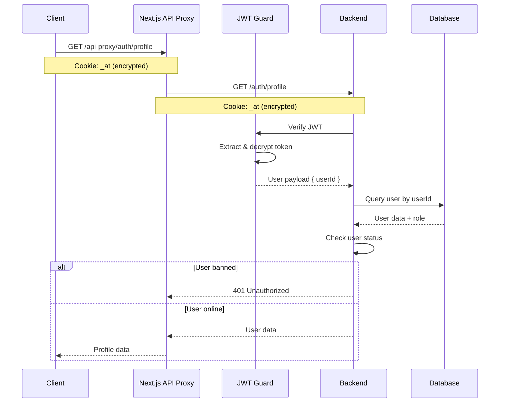
```mermaid
sequenceDiagram
    participant Client
    participant NextAPI as Next.js API Proxy
    participant Guard as JWT Guard
    participant Backend
    participant DB as Database
    
    Client->>NextAPI: GET /api-proxy/auth/profile
    Note over Client,NextAPI: Cookie: _at (encrypted)
    NextAPI->>Backend: GET /auth/profile
    Note over NextAPI,Backend: Cookie: _at (encrypted)
    
    Backend->>Guard: Verify JWT
    Guard->>Guard: Extract & decrypt token
    Guard-->>Backend: User payload { userId }
    
    Backend->>DB: Query user by userId
    DB-->>Backend: User data + role
    
    Backend->>Backend: Check user status
    alt User banned
        Backend-->>NextAPI: 401 Unauthorized
    else User online
        Backend-->>NextAPI: User data
        NextAPI-->>Client: Profile data
    end
```

**API Endpoint:**

```
GET /api/auth/profile
Headers:
  Cookie: _at=<encrypted_token>
  Authorization: Bearer <encrypted_token>

Response (200 OK):
{
  "status": true,
  "message": "Success",
  "data": {
    "user_id": 1,
    "username": "john_doe",
    "fullname": "John Doe",
    "email": "user@example.com",
    "role_id": 2,
    "role": {
      "role_id": 2,
      "role_name": "teacher"
    },
    ...
  }
}
```

---

## 4. MODULE CLASS MANAGEMENT

### 4.1. Tạo Lớp Học (Create Class)

**Sequence Diagram:**

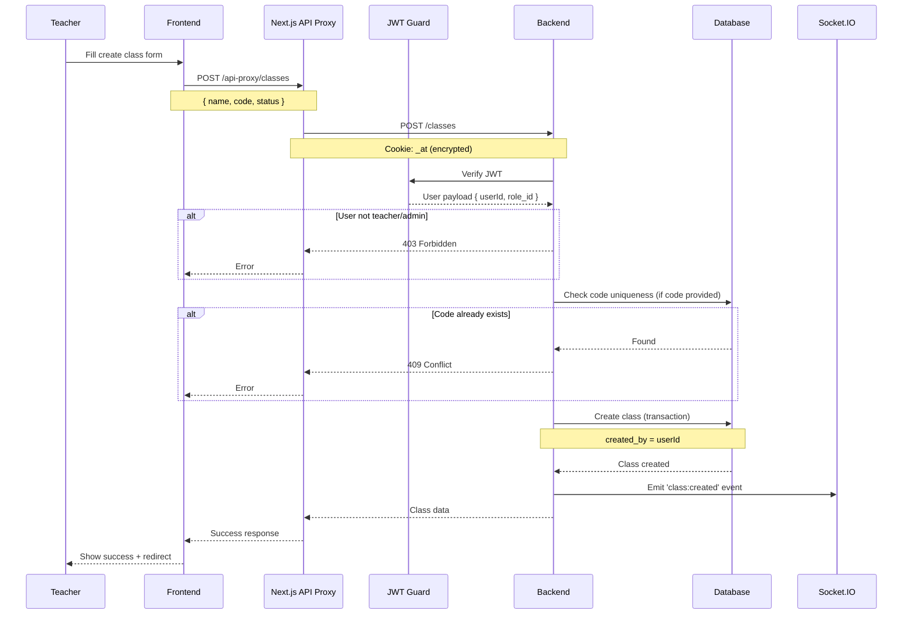
```mermaid
sequenceDiagram
    participant Teacher
    participant Frontend
    participant NextAPI as Next.js API Proxy
    participant Guard as JWT Guard
    participant Backend
    participant DB as Database
    participant Socket as Socket.IO
    
    Teacher->>Frontend: Fill create class form
    Frontend->>NextAPI: POST /api-proxy/classes
    Note over Frontend,NextAPI: { name, code, status }
    NextAPI->>Backend: POST /classes
    Note over NextAPI,Backend: Cookie: _at (encrypted)
    
    Backend->>Guard: Verify JWT
    Guard-->>Backend: User payload { userId, role_id }
    
    alt User not teacher/admin
        Backend-->>NextAPI: 403 Forbidden
        NextAPI-->>Frontend: Error
    end
    
    Backend->>DB: Check code uniqueness (if code provided)
    alt Code already exists
        DB-->>Backend: Found
        Backend-->>NextAPI: 409 Conflict
        NextAPI-->>Frontend: Error
    end
    
    Backend->>DB: Create class (transaction)
    Note over Backend,DB: created_by = userId
    DB-->>Backend: Class created
    
    Backend->>Socket: Emit 'class:created' event
    Backend-->>NextAPI: Class data
    NextAPI-->>Frontend: Success response
    Frontend-->>Teacher: Show success + redirect
```

**API Endpoint:**

```
POST /api/classes
Headers:
  Cookie: _at=<encrypted_token>
  Authorization: Bearer <encrypted_token>
Content-Type: application/json

Request Body:
{
  "name": "Lớp Toán 10A1",
  "code": "TOAN10A1",
  "student_count": 0,
  "status": "active"
}

Response (201 Created):
{
  "status": true,
  "message": "Tạo lớp học thành công",
  "data": {
    "class_id": 1,
    "name": "Lớp Toán 10A1",
    "code": "TOAN10A1",
    "student_count": 0,
    "status": "active",
    "created_by": 1,
    "creator": {
      "user_id": 1,
      "username": "teacher1",
      "fullname": "Nguyễn Văn A"
    },
    "created_at": "2025-01-29T10:00:00.000Z"
  }
}
```

**Validation Checks:**
- ✅ JWT token hợp lệ
- ✅ User có role = teacher hoặc admin
- ✅ Class code chưa tồn tại (nếu có)
- ✅ Input data hợp lệ

### 4.2. Xem Chi Tiết Lớp Học (Get Class by ID)

**Sequence Diagram:**

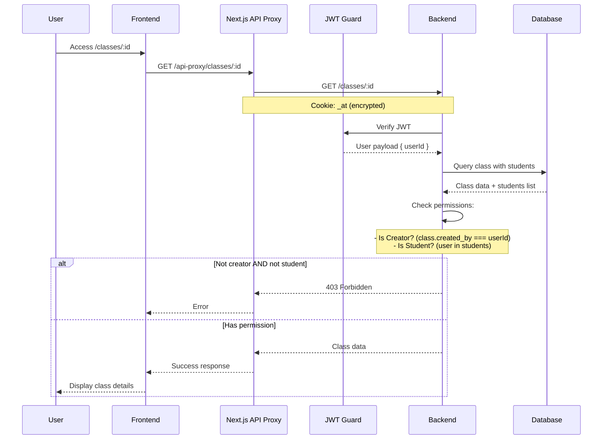
```mermaid
sequenceDiagram
    participant User
    participant Frontend
    participant NextAPI as Next.js API Proxy
    participant Guard as JWT Guard
    participant Backend
    participant DB as Database
    
    User->>Frontend: Access /classes/:id
    Frontend->>NextAPI: GET /api-proxy/classes/:id
    NextAPI->>Backend: GET /classes/:id
    Note over NextAPI,Backend: Cookie: _at (encrypted)
    
    Backend->>Guard: Verify JWT
    Guard-->>Backend: User payload { userId }
    
    Backend->>DB: Query class with students
    DB-->>Backend: Class data + students list
    
    Backend->>Backend: Check permissions:
    Note over Backend: - Is Creator? (class.created_by === userId)<br/>- Is Student? (user in students)
    
    alt Not creator AND not student
        Backend-->>NextAPI: 403 Forbidden
        NextAPI-->>Frontend: Error
    else Has permission
        Backend-->>NextAPI: Class data
        NextAPI-->>Frontend: Success response
        Frontend-->>User: Display class details
    end
```

**API Endpoint:**

```
GET /api/classes/:id
Headers:
  Cookie: _at=<encrypted_token>
  Authorization: Bearer <encrypted_token>

Response (200 OK):
{
  "status": true,
  "data": {
    "class_id": 1,
    "name": "Lớp Toán 10A1",
    "code": "TOAN10A1",
    "student_count": 25,
    "status": "active",
    "creator": { ... },
    "students": [
      {
        "id": 1,
        "user_id": 2,
        "username": "student1",
        "fullname": "Nguyễn Văn B",
        "status": "online"
      }
    ],
    "created_at": "2025-01-29T10:00:00.000Z"
  }
}
```

**Permission Rules:**
- ✅ **Creator (Teacher)**: Full access (xem, sửa, xóa, thêm học sinh)
- ✅ **Student**: Read-only access (xem lớp, xem bài tập)
- ❌ **Other users**: 403 Forbidden

### 4.3. Student Tham Gia Lớp (Join by Code)

**Sequence Diagram:**

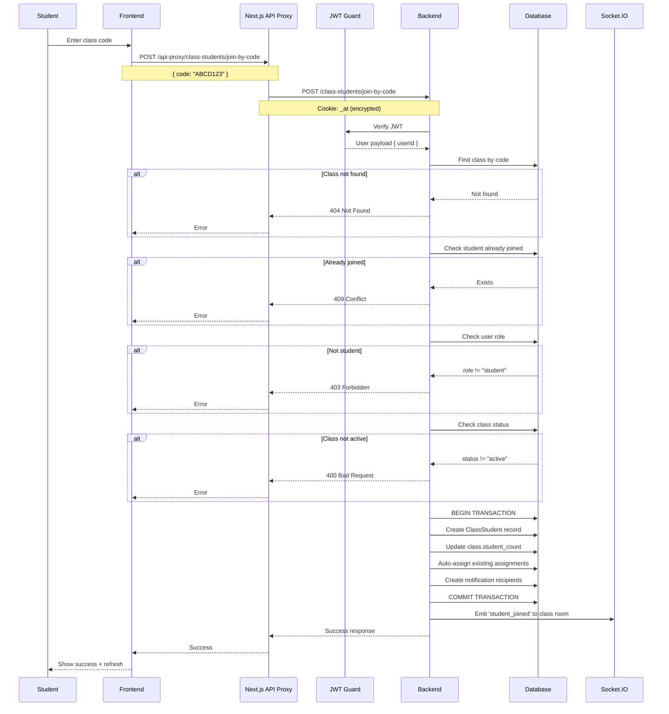
```mermaid
sequenceDiagram
    participant Student
    participant Frontend
    participant NextAPI as Next.js API Proxy
    participant Guard as JWT Guard
    participant Backend
    participant DB as Database
    participant Socket as Socket.IO
    
    Student->>Frontend: Enter class code
    Frontend->>NextAPI: POST /api-proxy/class-students/join-by-code
    Note over Frontend,NextAPI: { code: "ABCD123" }
    NextAPI->>Backend: POST /class-students/join-by-code
    Note over NextAPI,Backend: Cookie: _at (encrypted)
    
    Backend->>Guard: Verify JWT
    Guard-->>Backend: User payload { userId }
    
    Backend->>DB: Find class by code
    alt Class not found
        DB-->>Backend: Not found
        Backend-->>NextAPI: 404 Not Found
        NextAPI-->>Frontend: Error
    end
    
    Backend->>DB: Check student already joined
    alt Already joined
        DB-->>Backend: Exists
        Backend-->>NextAPI: 409 Conflict
        NextAPI-->>Frontend: Error
    end
    
    Backend->>DB: Check user role
    alt Not student
        DB-->>Backend: role != "student"
        Backend-->>NextAPI: 403 Forbidden
        NextAPI-->>Frontend: Error
    end
    
    Backend->>DB: Check class status
    alt Class not active
        DB-->>Backend: status != "active"
        Backend-->>NextAPI: 400 Bad Request
        NextAPI-->>Frontend: Error
    end
    
    Backend->>DB: BEGIN TRANSACTION
    Backend->>DB: Create ClassStudent record
    Backend->>DB: Update class.student_count
    Backend->>DB: Auto-assign existing assignments
    Backend->>DB: Create notification recipients
    Backend->>DB: COMMIT TRANSACTION
    
    Backend->>Socket: Emit 'student_joined' to class room
    Backend-->>NextAPI: Success response
    NextAPI-->>Frontend: Success
    Frontend-->>Student: Show success + refresh
```

**API Endpoint:**

```
POST /api/class-students/join-by-code
Headers:
  Cookie: _at=<encrypted_token>
Content-Type: application/json

Request Body:
{
  "code": "ABCD123"
}

Response (201 Created):
{
  "status": true,
  "message": "Tham gia lớp học thành công",
  "data": {
    "id": 1,
    "class_id": 1,
    "user_id": 2,
    "status": "online",
    "added_at": "2025-01-29T10:00:00.000Z"
  }
}
```

**Validation Checks:**
- ✅ JWT token hợp lệ
- ✅ Class code tồn tại
- ✅ User chưa tham gia lớp
- ✅ User role = "student"
- ✅ Class status = "active"

### 4.4. Class API Endpoints Summary

| Method | Endpoint | Description | Auth Required | Permission |
|--------|----------|-------------|---------------|------------|
| POST | `/api/classes` | Tạo lớp học mới | ✅ | Teacher/Admin |
| GET | `/api/classes/by-user/:userId` | Lấy danh sách lớp của user | ✅ | Owner |
| GET | `/api/classes/:id` | Xem chi tiết lớp | ✅ | Creator/Student |
| PATCH | `/api/classes/:id` | Cập nhật lớp | ✅ | Creator only |
| DELETE | `/api/classes/:id` | Xóa lớp | ✅ | Creator only |
| POST | `/api/class-students` | Thêm học sinh vào lớp | ✅ | Creator only |
| POST | `/api/class-students/join-by-code` | Học sinh tham gia bằng code | ✅ | Student only |
| GET | `/api/class-students/by-user/:userId` | Lấy danh sách lớp của học sinh | ✅ | Owner |
| GET | `/api/class-students/by-class/:classId` | Lấy danh sách học sinh trong lớp | ✅ | Creator/Student |

---

## 5. MODULE EXERCISE/ASSIGNMENT

### 5.1. Tạo Bài Tập (Create Assignment)

**Sequence Diagram:**

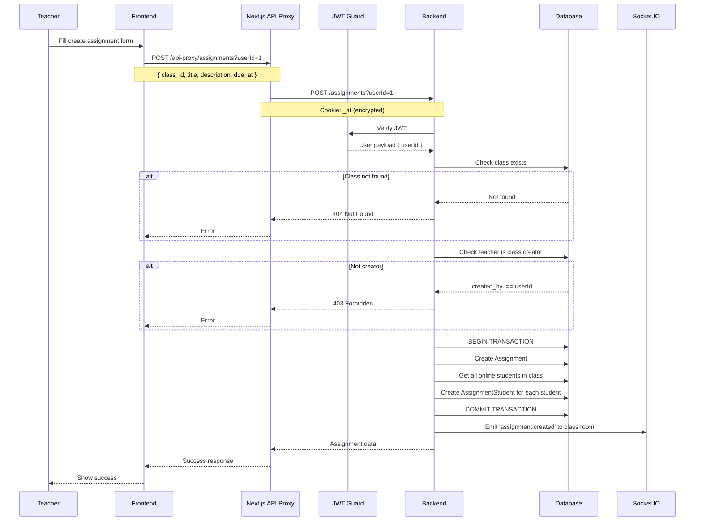
```mermaid
sequenceDiagram
    participant Teacher
    participant Frontend
    participant NextAPI as Next.js API Proxy
    participant Guard as JWT Guard
    participant Backend
    participant DB as Database
    participant Socket as Socket.IO
    
    Teacher->>Frontend: Fill create assignment form
    Frontend->>NextAPI: POST /api-proxy/assignments?userId=1
    Note over Frontend,NextAPI: { class_id, title, description, due_at }
    NextAPI->>Backend: POST /assignments?userId=1
    Note over NextAPI,Backend: Cookie: _at (encrypted)
    
    Backend->>Guard: Verify JWT
    Guard-->>Backend: User payload { userId }
    
    Backend->>DB: Check class exists
    alt Class not found
        DB-->>Backend: Not found
        Backend-->>NextAPI: 404 Not Found
        NextAPI-->>Frontend: Error
    end
    
    Backend->>DB: Check teacher is class creator
    alt Not creator
        DB-->>Backend: created_by !== userId
        Backend-->>NextAPI: 403 Forbidden
        NextAPI-->>Frontend: Error
    end
    
    Backend->>DB: BEGIN TRANSACTION
    Backend->>DB: Create Assignment
    Backend->>DB: Get all online students in class
    Backend->>DB: Create AssignmentStudent for each student
    Backend->>DB: COMMIT TRANSACTION
    
    Backend->>Socket: Emit 'assignment:created' to class room
    Backend-->>NextAPI: Assignment data
    NextAPI-->>Frontend: Success response
    Frontend-->>Teacher: Show success
```

**API Endpoint:**

```
POST /api/assignments?userId=1
Headers:
  Cookie: _at=<encrypted_token>
Content-Type: application/json

Request Body:
{
  "class_id": 1,
  "title": "Bài tập về nhà tuần 1",
  "description": "Làm bài tập số 1, 2, 3 trong sách",
  "due_at": "2025-02-15T23:59:59.000Z"
}

Response (201 Created):
{
  "status": true,
  "data": {
    "assignment_id": 1,
    "class_id": 1,
    "title": "Bài tập về nhà tuần 1",
    "description": "...",
    "due_at": "2025-02-15T23:59:59.000Z",
    "created_by": 1,
    "creator": { ... },
    "class": { ... },
    "created_at": "2025-01-29T10:00:00.000Z"
  }
}
```

**Auto Actions:**
- Tự động tạo `AssignmentStudent` cho tất cả học sinh online trong lớp
- Status mặc định: `ASSIGNED`

### 5.2. Student Nộp Bài (Submit Assignment)

**Sequence Diagram:**

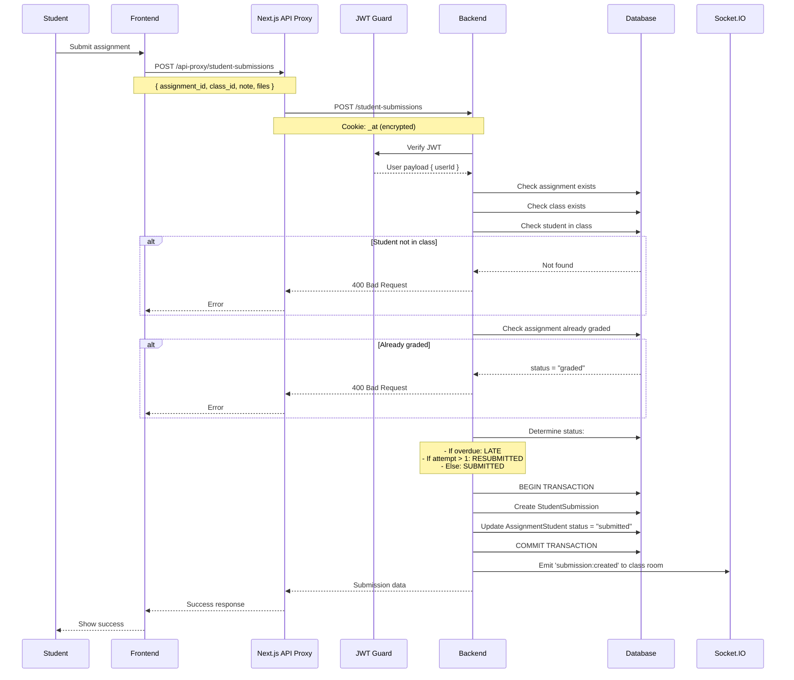
```mermaid
sequenceDiagram
    participant Student
    participant Frontend
    participant NextAPI as Next.js API Proxy
    participant Guard as JWT Guard
    participant Backend
    participant DB as Database
    participant Socket as Socket.IO
    
    Student->>Frontend: Submit assignment
    Frontend->>NextAPI: POST /api-proxy/student-submissions
    Note over Frontend,NextAPI: { assignment_id, class_id, note, files }
    NextAPI->>Backend: POST /student-submissions
    Note over NextAPI,Backend: Cookie: _at (encrypted)
    
    Backend->>Guard: Verify JWT
    Guard-->>Backend: User payload { userId }
    
    Backend->>DB: Check assignment exists
    Backend->>DB: Check class exists
    Backend->>DB: Check student in class
    alt Student not in class
        DB-->>Backend: Not found
        Backend-->>NextAPI: 400 Bad Request
        NextAPI-->>Frontend: Error
    end
    
    Backend->>DB: Check assignment already graded
    alt Already graded
        DB-->>Backend: status = "graded"
        Backend-->>NextAPI: 400 Bad Request
        NextAPI-->>Frontend: Error
    end
    
    Backend->>DB: Determine status:
    Note over Backend: - If overdue: LATE<br/>- If attempt > 1: RESUBMITTED<br/>- Else: SUBMITTED
    
    Backend->>DB: BEGIN TRANSACTION
    Backend->>DB: Create StudentSubmission
    Backend->>DB: Update AssignmentStudent status = "submitted"
    Backend->>DB: COMMIT TRANSACTION
    
    Backend->>Socket: Emit 'submission:created' to class room
    Backend-->>NextAPI: Submission data
    NextAPI-->>Frontend: Success response
    Frontend-->>Student: Show success
```

**API Endpoint:**

```
POST /api/student-submissions
Headers:
  Cookie: _at=<encrypted_token>
Content-Type: application/json

Request Body:
{
  "assignment_id": 1,
  "class_id": 1,
  "student_id": 2,
  "note": "Đã hoàn thành bài tập",
  "files": [
    {
      "file_name": "baitap.pdf",
      "file_url": "https://...",
      "file_type": "application/pdf",
      "file_size": 1024000
    }
  ]
}

Response (201 Created):
{
  "status": true,
  "data": {
    "submission_id": 1,
    "assignment_id": 1,
    "student_id": 2,
    "attempt_no": 1,
    "status": "SUBMITTED",
    "submitted_at": "2025-01-29T10:00:00.000Z",
    "attachments": [ ... ]
  }
}
```

**Validation Checks:**
- ✅ JWT token hợp lệ
- ✅ Assignment tồn tại
- ✅ Class tồn tại
- ✅ Student có trong lớp
- ✅ Assignment chưa được chấm điểm (nếu nộp lại)
- ✅ student_id === userId (từ JWT)

### 5.3. Teacher Chấm Điểm (Grade Assignment)

**Sequence Diagram:**

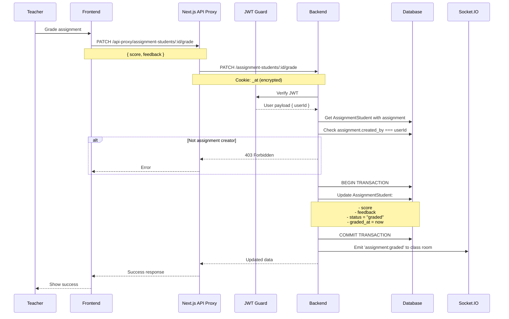
```mermaid
sequenceDiagram
    participant Teacher
    participant Frontend
    participant NextAPI as Next.js API Proxy
    participant Guard as JWT Guard
    participant Backend
    participant DB as Database
    participant Socket as Socket.IO
    
    Teacher->>Frontend: Grade assignment
    Frontend->>NextAPI: PATCH /api-proxy/assignment-students/:id/grade
    Note over Frontend,NextAPI: { score, feedback }
    NextAPI->>Backend: PATCH /assignment-students/:id/grade
    Note over NextAPI,Backend: Cookie: _at (encrypted)
    
    Backend->>Guard: Verify JWT
    Guard-->>Backend: User payload { userId }
    
    Backend->>DB: Get AssignmentStudent with assignment
    Backend->>DB: Check assignment.created_by === userId
    alt Not assignment creator
        Backend-->>NextAPI: 403 Forbidden
        NextAPI-->>Frontend: Error
    end
    
    Backend->>DB: BEGIN TRANSACTION
    Backend->>DB: Update AssignmentStudent:
    Note over Backend,DB: - score<br/>- feedback<br/>- status = "graded"<br/>- graded_at = now
    Backend->>DB: COMMIT TRANSACTION
    
    Backend->>Socket: Emit 'assignment:graded' to class room
    Backend-->>NextAPI: Updated data
    NextAPI-->>Frontend: Success response
    Frontend-->>Teacher: Show success
```

**API Endpoint:**

```
PATCH /api/assignment-students/:id/grade
Headers:
  Cookie: _at=<encrypted_token>
Content-Type: application/json

Request Body:
{
  "score": 8.5,
  "feedback": "Làm tốt, cần cải thiện phần trình bày"
}

Response (200 OK):
{
  "status": true,
  "data": {
    "id": 1,
    "assignment_id": 1,
    "student_id": 2,
    "score": 8.5,
    "feedback": "...",
    "status": "GRADED",
    "graded_at": "2025-01-29T10:00:00.000Z"
  }
}
```

**Permission Check:**
- ✅ User phải là người tạo bài tập (assignment.created_by === userId)

### 5.4. Assignment API Endpoints Summary

| Method | Endpoint | Description | Auth Required | Permission |
|--------|----------|-------------|---------------|------------|
| POST | `/api/assignments?userId=:id` | Tạo bài tập mới | ✅ | Class Creator |
| GET | `/api/assignments` | Lấy danh sách bài tập | ✅ | - |
| GET | `/api/assignments/by-class/:classId` | Lấy bài tập theo lớp | ✅ | Class Member |
| GET | `/api/assignments/:id` | Xem chi tiết bài tập | ✅ | Creator/Assigned Student |
| PATCH | `/api/assignments/:id` | Cập nhật bài tập | ✅ | Creator only |
| DELETE | `/api/assignments/:id` | Xóa bài tập | ✅ | Creator only |
| POST | `/api/student-submissions` | Nộp bài tập | ✅ | Assigned Student |
| GET | `/api/student-submissions/by-assignment/:assignmentId` | Lấy danh sách bài nộp | ✅ | Creator only |
| PATCH | `/api/assignment-students/:id/grade` | Chấm điểm | ✅ | Assignment Creator |
| PATCH | `/api/assignment-students/:id/ungrade` | Gỡ điểm | ✅ | Assignment Creator |

---

## 6. MODULE NOTIFICATION

### 6.1. Tạo Thông Báo (Create Notification)

**Sequence Diagram:**

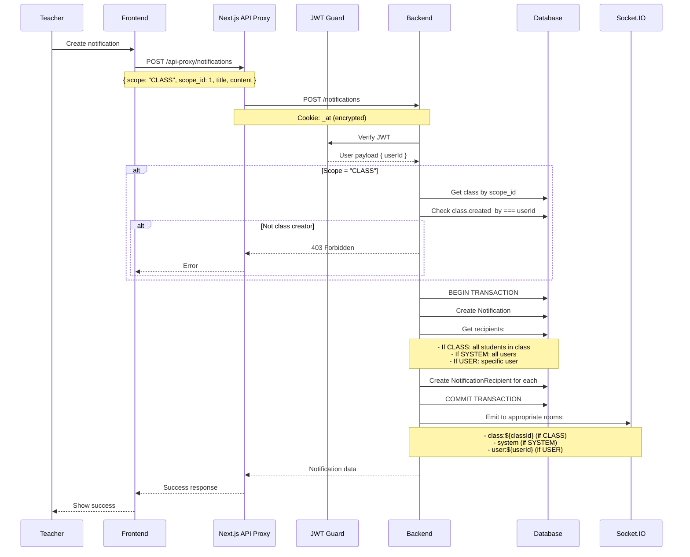
```mermaid
sequenceDiagram
    participant Teacher
    participant Frontend
    participant NextAPI as Next.js API Proxy
    participant Guard as JWT Guard
    participant Backend
    participant DB as Database
    participant Socket as Socket.IO
    
    Teacher->>Frontend: Create notification
    Frontend->>NextAPI: POST /api-proxy/notifications
    Note over Frontend,NextAPI: { scope: "CLASS", scope_id: 1, title, content }
    NextAPI->>Backend: POST /notifications
    Note over NextAPI,Backend: Cookie: _at (encrypted)
    
    Backend->>Guard: Verify JWT
    Guard-->>Backend: User payload { userId }
    
    alt Scope = "CLASS"
        Backend->>DB: Get class by scope_id
        Backend->>DB: Check class.created_by === userId
        alt Not class creator
            Backend-->>NextAPI: 403 Forbidden
            NextAPI-->>Frontend: Error
        end
    end
    
    Backend->>DB: BEGIN TRANSACTION
    Backend->>DB: Create Notification
    Backend->>DB: Get recipients:
    Note over Backend,DB: - If CLASS: all students in class<br/>- If SYSTEM: all users<br/>- If USER: specific user
    Backend->>DB: Create NotificationRecipient for each
    Backend->>DB: COMMIT TRANSACTION
    
    Backend->>Socket: Emit to appropriate rooms:
    Note over Backend,Socket: - class:${classId} (if CLASS)<br/>- system (if SYSTEM)<br/>- user:${userId} (if USER)
    Backend-->>NextAPI: Notification data
    NextAPI-->>Frontend: Success response
    Frontend-->>Teacher: Show success
```

**API Endpoint:**

```
POST /api/notifications
Headers:
  Cookie: _at=<encrypted_token>
Content-Type: application/json

Request Body:
{
  "scope": "CLASS",
  "scope_id": 1,
  "title": "Thông báo bài tập mới",
  "content": "Có bài tập mới cần hoàn thành",
  "created_by": 1
}

Response (201 Created):
{
  "status": true,
  "data": {
    "notification_id": 1,
    "scope": "CLASS",
    "scope_id": 1,
    "title": "Thông báo bài tập mới",
    "content": "...",
    "created_by": 1,
    "created_at": "2025-01-29T10:00:00.000Z"
  }
}
```

**Permission Rules:**
- ✅ **CLASS scope**: Chỉ giáo viên tạo lớp mới có quyền
- ✅ **SYSTEM scope**: Chỉ Admin/SuperAdmin
- ✅ **USER scope**: Bất kỳ user nào

### 6.2. Xem Thông Báo (Get Notifications)

**Sequence Diagram:**

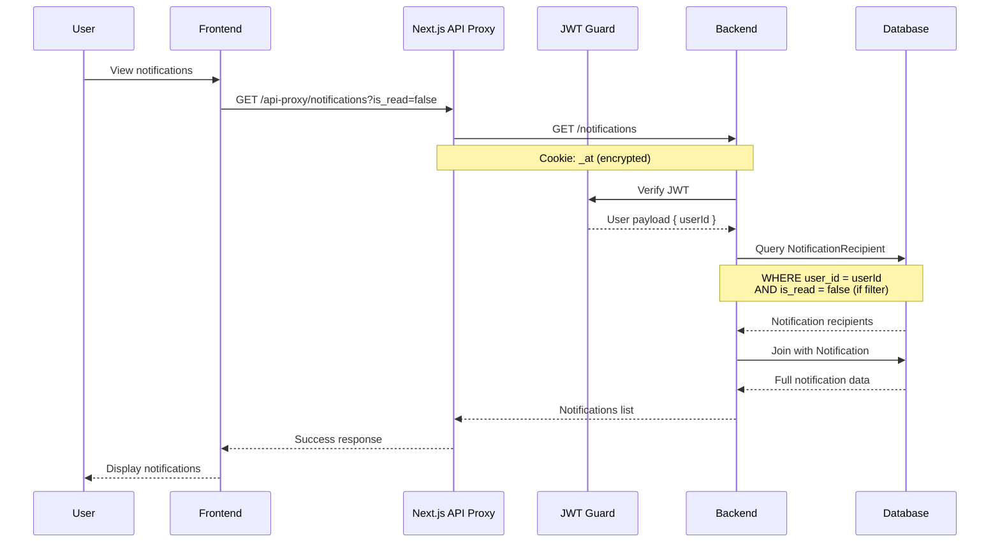
```mermaid
sequenceDiagram
    participant User
    participant Frontend
    participant NextAPI as Next.js API Proxy
    participant Guard as JWT Guard
    participant Backend
    participant DB as Database
    
    User->>Frontend: View notifications
    Frontend->>NextAPI: GET /api-proxy/notifications?is_read=false
    NextAPI->>Backend: GET /notifications
    Note over NextAPI,Backend: Cookie: _at (encrypted)
    
    Backend->>Guard: Verify JWT
    Guard-->>Backend: User payload { userId }
    
    Backend->>DB: Query NotificationRecipient
    Note over Backend,DB: WHERE user_id = userId<br/>AND is_read = false (if filter)
    DB-->>Backend: Notification recipients
    
    Backend->>DB: Join with Notification
    DB-->>Backend: Full notification data
    
    Backend-->>NextAPI: Notifications list
    NextAPI-->>Frontend: Success response
    Frontend-->>User: Display notifications
```

**API Endpoint:**

```
GET /api/notifications?is_read=false&scope=CLASS&scope_id=1
Headers:
  Cookie: _at=<encrypted_token>

Response (200 OK):
{
  "status": true,
  "data": [
    {
      "notification_id": 1,
      "title": "Thông báo bài tập mới",
      "content": "...",
      "scope": "CLASS",
      "scope_id": 1,
      "is_read": false,
      "read_at": null,
      "created_at": "2025-01-29T10:00:00.000Z"
    }
  ],
  "total": 5
}
```

### 6.3. Đánh Dấu Đã Đọc (Mark as Read)

**API Endpoint:**

```
PATCH /api/notifications/:id/read
Headers:
  Cookie: _at=<encrypted_token>

Response (200 OK):
{
  "status": true,
  "message": "Đã đánh dấu đọc",
  "data": {
    "notification_id": 1,
    "is_read": true,
    "read_at": "2025-01-29T10:00:00.000Z"
  }
}
```

### 6.4. Notification API Endpoints Summary

| Method | Endpoint | Description | Auth Required | Permission |
|--------|----------|-------------|---------------|------------|
| POST | `/api/notifications` | Tạo thông báo | ✅ | Class Creator/Admin |
| GET | `/api/notifications` | Lấy danh sách thông báo | ✅ | Owner |
| GET | `/api/notifications/:id` | Xem chi tiết thông báo | ✅ | Recipient |
| PATCH | `/api/notifications/:id/read` | Đánh dấu đã đọc | ✅ | Recipient |
| DELETE | `/api/notifications/:id` | Xóa thông báo | ✅ | Creator/Admin |

---

## 7. SOCKET.IO REAL-TIME COMMUNICATION

### 7.1. Connection Authentication

**Sequence Diagram:**

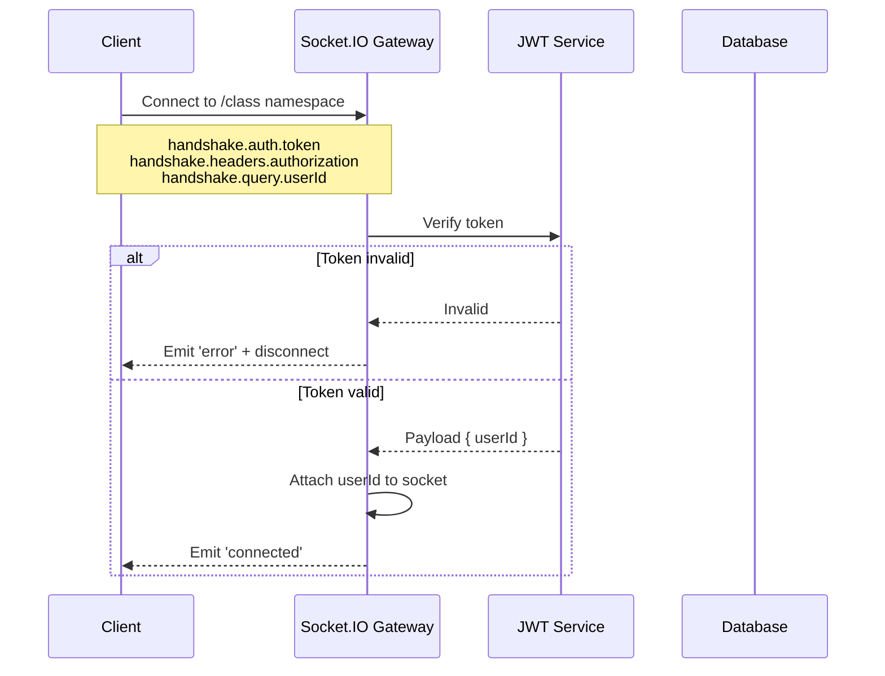
```mermaid
sequenceDiagram
    participant Client
    participant Socket as Socket.IO Gateway
    participant JWT as JWT Service
    participant DB as Database
    
    Client->>Socket: Connect to /class namespace
    Note over Client,Socket: handshake.auth.token<br/>handshake.headers.authorization<br/>handshake.query.userId
    
    Socket->>JWT: Verify token
    alt Token invalid
        JWT-->>Socket: Invalid
        Socket-->>Client: Emit 'error' + disconnect
    else Token valid
        JWT-->>Socket: Payload { userId }
        Socket->>Socket: Attach userId to socket
        Socket-->>Client: Emit 'connected'
    end
```

**Connection Flow:**

```typescript
// Client side
const socket = io('http://localhost:3001/class', {
  auth: {
    token: encryptedAccessToken,
    user_id: userId
  },
  query: {
    userId: String(userId)
  }
});

// Server side
async handleConnection(client: Socket) {
  const token = client.handshake.auth?.token || 
                client.handshake.headers?.authorization?.replace('Bearer ', '');
  
  try {
    const payload = await this.jwtService.verifyAsync(token, { secret });
    (client as any).userId = payload.sub;
    client.emit('connected', { user_id: payload.sub });
  } catch (error) {
    client.emit('error', { error: 'Authentication failed' });
    client.disconnect();
  }
}
```

### 7.2. Join Class Room

**Sequence Diagram:**

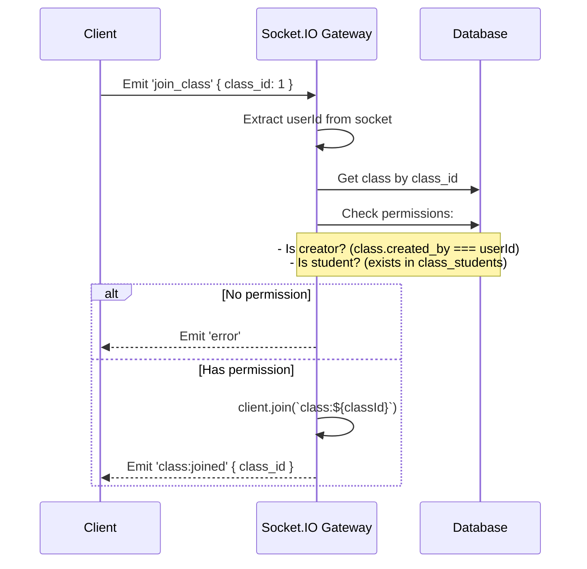
```mermaid
sequenceDiagram
    participant Client
    participant Socket as Socket.IO Gateway
    participant DB as Database
    
    Client->>Socket: Emit 'join_class' { class_id: 1 }
    
    Socket->>Socket: Extract userId from socket
    Socket->>DB: Get class by class_id
    Socket->>DB: Check permissions:
    Note over Socket,DB: - Is creator? (class.created_by === userId)<br/>- Is student? (exists in class_students)
    
    alt No permission
        Socket-->>Client: Emit 'error'
    else Has permission
        Socket->>Socket: client.join(`class:${classId}`)
        Socket-->>Client: Emit 'class:joined' { class_id }
    end
```

**Socket Events:**

| Event | Direction | Description | Data |
|-------|-----------|-------------|------|
| `join_class` | Client → Server | Tham gia room lớp học | `{ class_id: number }` |
| `leave_class` | Client → Server | Rời room lớp học | `{ class_id: number }` |
| `class:joined` | Server → Client | Xác nhận đã tham gia | `{ class_id: number }` |
| `class:error` | Server → Client | Lỗi khi tham gia | `{ error: string }` |
| `assignment:created` | Server → Client | Bài tập mới được tạo | `{ assignment: {...} }` |
| `submission:created` | Server → Client | Bài tập được nộp | `{ submission: {...} }` |
| `assignment:graded` | Server → Client | Bài tập được chấm điểm | `{ assignment_student: {...} }` |
| `student_joined` | Server → Client | Học sinh mới tham gia lớp | `{ student: {...} }` |

### 7.3. Notification Socket Events

**Namespace:** `/notification`

| Event | Direction | Description | Data |
|-------|-----------|-------------|------|
| `join_class_notifications` | Client → Server | Tham gia room thông báo lớp | `{ class_id: number }` |
| `leave_class_notifications` | Client → Server | Rời room thông báo lớp | `{ class_id: number }` |
| `notification:new` | Server → Client | Thông báo mới | `{ notification: {...} }` |
| `notification:class_joined` | Server → Client | Xác nhận tham gia room | `{ class_id: number }` |

---

## 8. API REFERENCE

### 8.1. Authentication APIs

| Method | Endpoint | Description | Auth | Request Body |
|--------|----------|-------------|------|--------------|
| POST | `/api/auth/signup` | Đăng ký tài khoản | ❌ | `{ username, email, password, ... }` |
| POST | `/api/auth/signin` | Đăng nhập | ❌ | `{ emailOrUsername, password, device_name }` |
| POST | `/api/auth/signout` | Đăng xuất | ✅ | - |
| POST | `/api/auth/refresh` | Lấy access token mới | ✅ | - |
| GET | `/api/auth/profile` | Lấy thông tin profile | ✅ | - |

### 8.2. Class Management APIs

| Method | Endpoint | Description | Auth | Permission |
|--------|----------|-------------|------|------------|
| POST | `/api/classes` | Tạo lớp học | ✅ | Teacher/Admin |
| GET | `/api/classes/by-user/:userId` | Lấy lớp của user | ✅ | Owner |
| GET | `/api/classes/:id` | Xem chi tiết lớp | ✅ | Creator/Student |
| PATCH | `/api/classes/:id` | Cập nhật lớp | ✅ | Creator only |
| DELETE | `/api/classes/:id` | Xóa lớp | ✅ | Creator only |
| POST | `/api/class-students` | Thêm học sinh | ✅ | Creator only |
| POST | `/api/class-students/join-by-code` | Tham gia bằng code | ✅ | Student only |
| GET | `/api/class-students/by-user/:userId` | Lấy lớp của học sinh | ✅ | Owner |
| GET | `/api/class-students/by-class/:classId` | Lấy học sinh trong lớp | ✅ | Creator/Student |

### 8.3. Assignment APIs

| Method | Endpoint | Description | Auth | Permission |
|--------|----------|-------------|------|------------|
| POST | `/api/assignments?userId=:id` | Tạo bài tập | ✅ | Class Creator |
| GET | `/api/assignments` | Lấy danh sách bài tập | ✅ | - |
| GET | `/api/assignments/by-class/:classId` | Lấy bài tập theo lớp | ✅ | Class Member |
| GET | `/api/assignments/:id` | Xem chi tiết bài tập | ✅ | Creator/Assigned Student |
| PATCH | `/api/assignments/:id` | Cập nhật bài tập | ✅ | Creator only |
| DELETE | `/api/assignments/:id` | Xóa bài tập | ✅ | Creator only |
| POST | `/api/student-submissions` | Nộp bài tập | ✅ | Assigned Student |
| GET | `/api/student-submissions/by-assignment/:assignmentId` | Lấy bài nộp | ✅ | Creator only |
| PATCH | `/api/assignment-students/:id/grade` | Chấm điểm | ✅ | Assignment Creator |
| PATCH | `/api/assignment-students/:id/ungrade` | Gỡ điểm | ✅ | Assignment Creator |

### 8.4. Notification APIs

| Method | Endpoint | Description | Auth | Permission |
|--------|----------|-------------|------|------------|
| POST | `/api/notifications` | Tạo thông báo | ✅ | Class Creator/Admin |
| GET | `/api/notifications` | Lấy danh sách thông báo | ✅ | Owner |
| GET | `/api/notifications/:id` | Xem chi tiết thông báo | ✅ | Recipient |
| PATCH | `/api/notifications/:id/read` | Đánh dấu đã đọc | ✅ | Recipient |
| DELETE | `/api/notifications/:id` | Xóa thông báo | ✅ | Creator/Admin |

### 8.5. User Management APIs

| Method | Endpoint | Description | Auth | Permission |
|--------|----------|-------------|------|------------|
| POST | `/api/users` | Tạo user | ✅ | Admin/SuperAdmin |
| GET | `/api/users` | Lấy danh sách users | ✅ | Admin/SuperAdmin |
| GET | `/api/users/:id` | Xem chi tiết user | ✅ | Admin/Owner |
| PATCH | `/api/users/:id` | Cập nhật user | ✅ | Admin/Owner |
| DELETE | `/api/users/:id` | Xóa user | ✅ | Admin/SuperAdmin |
| GET | `/api/users/students` | Lấy danh sách học sinh | ✅ | Teacher/Admin |
| PATCH | `/api/users/:id/status` | Cập nhật status | ✅ | Admin/SuperAdmin |

---

## 9. SECURITY ARCHITECTURE

### 9.1. Authentication Security

**JWT Token Security:**
- ✅ Access Token: 15 phút expiry
- ✅ Refresh Token: 7 ngày expiry, lưu trong database
- ✅ AES-256-CBC encryption cho cookies
- ✅ httpOnly, secure, sameSite flags

**Password Security:**
- ✅ bcrypt hashing với salt rounds = 10
- ✅ Minimum 6 characters
- ✅ Không lưu plain text

### 9.2. Authorization Security

**Permission Model:**
- ✅ Role-based: student, teacher, admin, super_admin
- ✅ Ownership-based: created_by checks
- ✅ Membership-based: class membership checks

**Validation Layers:**
1. JWT Guard: Verify token
2. Permission Check: Check role/ownership
3. Business Logic: Check business rules

### 9.3. Data Security

**Input Validation:**
- ✅ DTO validation với class-validator
- ✅ Type checking
- ✅ SQL injection prevention (TypeORM parameterized queries)

**Output Sanitization:**
- ✅ Response DTOs (không trả về sensitive data)
- ✅ Password hash không bao giờ trả về

### 9.4. Cookie Security

```typescript
// Cookie configuration
{
  httpOnly: true,      // Không thể truy cập từ JavaScript
  secure: true,        // Chỉ gửi qua HTTPS
  sameSite: 'strict',  // Chống CSRF
  maxAge: 15 * 60 * 1000  // 15 phút
}
```

### 9.5. Socket.IO Security

**Authentication:**
- ✅ JWT token trong handshake
- ✅ Verify token trước khi connect
- ✅ Attach userId to socket

**Authorization:**
- ✅ Check permissions trước khi join room
- ✅ Verify ownership trước khi emit events

---

## 10. DEPLOYMENT & CONFIGURATION

### 10.1. Environment Variables

**Backend (NestJS):**
```env
# Database
DB_HOST=localhost
DB_PORT=3306
DB_USERNAME=root
DB_PASSWORD=password
DB_DATABASE=edulearn

# JWT
JWT_SECRET=your-secret-key
JWT_EXPIRES_IN=15m
JWT_REFRESH_EXPIRES_IN_DAYS=7

# Encryption
ENCRYPTION_KEY=your-32-byte-key

# Server
PORT=3001
NODE_ENV=production
```

**Frontend (Next.js):**
```env
NEXT_PUBLIC_API_URL=http://localhost:3001
NEXT_PUBLIC_SOCKET_URL=http://localhost:3001
```

### 10.2. Database Schema

**Key Tables:**
- `users`: User accounts
- `roles`: User roles
- `classes`: Class information
- `class_students`: Class membership
- `assignments`: Assignment data
- `assignment_students`: Assignment assignment
- `student_submissions`: Student submissions
- `notifications`: Notification data
- `notification_recipients`: Notification delivery
- `auth_tokens`: Refresh tokens

### 10.3. Deployment Checklist

-  Set up MySQL database
-  Configure environment variables
-  Run database migrations
-  Build frontend: `npm run build`
-  Start backend: `npm run start:prod`
-  Start frontend: `npm run start`
-  Configure reverse proxy (Nginx)
-  Set up SSL certificates
-  Configure firewall rules

---

## KẾT LUẬN

Tài liệu này mô tả toàn bộ hệ thống EduLearn với:

-  **Authentication & Authorization**: JWT với encryption, refresh token mechanism
-  **Class Management**: Tạo lớp, quản lý học sinh, permission checks
-  **Exercise/Assignment**: Tạo bài tập, nộp bài, chấm điểm
-  **Notification**: Real-time notifications với Socket.IO
-  **Security**: Multi-layer security với encryption, validation, authorization
-  **API Reference**: Đầy đủ các endpoints và permissions

Hệ thống được thiết kế với:
- **Security First**: Multi-layer authentication và authorization
- **Scalability**: Microservices architecture
- **Real-time**: Socket.IO cho instant updates
- **User Experience**: Optimized với caching và sessionStorage

---

**Document Version:** 1.0.0  
**Last Updated:** 2025-01-29  
**Maintained by:** EduLearn Development Team
